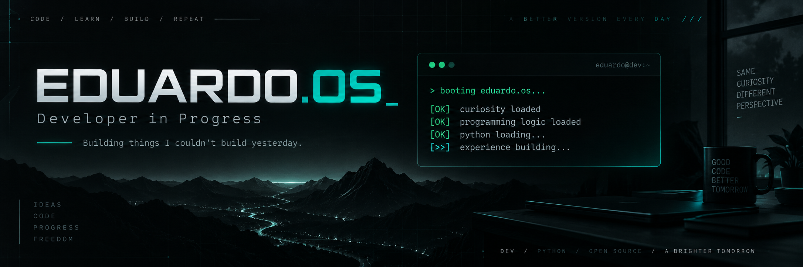

<p align="center">
  
</p>

<div align="center">

# `EDUARDO.OS`

### Developer in Progress

**Building things I couldn't build yesterday.**

</div>

<br>

```text
> booting eduardo.os...

[OK] curiosity loaded
[OK] programming logic loaded
[OK] problem solving loaded
[>>] python loading...
[>>] experience building...
```

---

## `> whoami`

```text
Name      : Eduardo Fellipe
Role      : Developer in Progress
Location  : Goiânia, Brazil
Focus     : Programming • Software Development • Problem Solving
Status    : Learning and building
```

Construindo minha base em desenvolvimento de software, transformando estudos em código e código em projetos.

Quero entender não só como programar, mas **como as coisas funcionam**.

---

## `> current_mission`

```text
[✓] Learn programming logic
[✓] Build algorithms with Portugol
[>>] Improve Python fundamentals
[>>] Learn Git & GitHub
[ ] Build my first complete application
[ ] Work with APIs
[ ] Build real-world projects
[ ] Ship something people actually use
```

---

## `> skill_tree`

### Languages

<p>
  
</p>

```text
Python       █████░░░░░  LEARNING
Portugol     ██████░░░░  LEARNING
```

### Core

```text
Programming Logic    ██████░░░░
Algorithms           █████░░░░░
Problem Solving      █████░░░░░
Git / GitHub         ███░░░░░░░
```

> Progress bars represent my learning journey, not proficiency certifications.

---

## `> project_archive`

```text
01 // LOGIC LAB
     Programming fundamentals & challenges
     STATUS: BUILDING

02 // PYTHON LAB
     Experiments and Python projects
     STATUS: LOADING

03 // DEV LOG
     My journey from beginner to developer
     STATUS: COMING SOON

04 // ???
     Next transmission incoming...
```

---

## `> currently_learning`

```python
current_focus = [
    "Programming Logic",
    "Python",
    "Algorithms",
    "Git & GitHub",
    "Software Development"
]

while True:
    learn()
    build()
    break_things()
    understand_why()
    build_better()
```

---

## `> dev_philosophy`

```text
I don't want to collect technologies.

I want to understand them.

Learn.
Build.
Break.
Fix.
Improve.
Repeat.
```

---

## `> system_stats`

<p align="center">
  
</p>

<p align="center">
  
</p>

---

## `> connection`

<p align="center">

<a href="https://github.com/eduardofellipe">
  
</a>

<a href="https://instagram.com/Eduardofellipe_">
  
</a>

</p>

---

<div align="center">

```text
eduardo@dev:~$ ./next_goal

Building something worth starring.

█
```

### `CODE / LEARN / BUILD / REPEAT`

</div>
